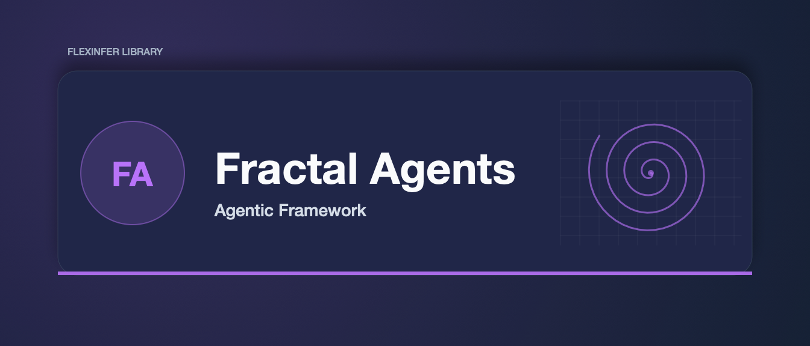

# Fractal Agents


[](https://gitlab.flexinfer.ai/libs/fractal-agents/-/commits/main)
[](https://gitlab.flexinfer.ai/libs/fractal-agents/-/commits/main)

**Fractal Agents** is a recursive, self-similar agentic framework designed to optimize complex task execution and context management, specifically tailored for constrained hardware (e.g., local Consumer GPUs) and massive-scale workflows.

## Core Philosophy

Traditional multi-agent systems often rely on rigid hierarchies (Manager -> Worker). **Fractal Agents** treats every agent as a **FractalNode**.

1.  **Self-Similarity:** Every node behaves identically. It receives a goal and context.
2.  **Mitosis (Fractal Split):** If a task is too complex, the node splits the task into sub-goals and spawns child nodes.
3.  **Context Zooming:** Only the _active branch_ of the recursion tree is loaded into the LLM's immediate context window. Sibling and parent states are compressed and stored in Redis ("Frozen Memory"), allowing for effectively infinite context depth.

## Architecture

### The FractalNode

The fundamental unit.

- **Input:** Goal, Parent Context (Compressed).
- **State:** Pending, Active, Split, or Completed.
- **Action:** It either solves the task (if simple) or decomposes it (if complex).

### Frozen Memory (Redis)

We utilize Redis to store the state of the fractal tree.

- **Active Memory:** The current executing node's VRAM context.
- **Frozen Memory:** Serialized state of all other nodes in Redis Hashes.
  - _New:_ State is automatically compressed with **LZ4** to minimize Redis memory footprint.

## Installation

```bash
pip install -r requirements.txt
```

## Environment Configuration

This project uses `direnv` for automated environment management.

1.  **Copy the example env:**
    ```bash
    cp .env.example .env
    ```
2.  **Allow direnv:**
    ```bash
    direnv allow
    ```

The `.envrc` automatically sources your cluster's `dev-env.sh` and your local `ai.env` secrets, then applies project-specific overrides from `.env`.

## Usage

```python
from fractal_agents.core import FractalNode

# Initialize the root node with a complex goal
root = FractalNode(goal="Write a complete sci-fi novel about AI")

# Run the fractal process
root.run()
```
